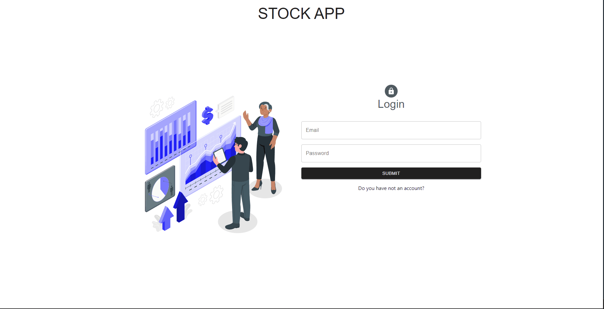
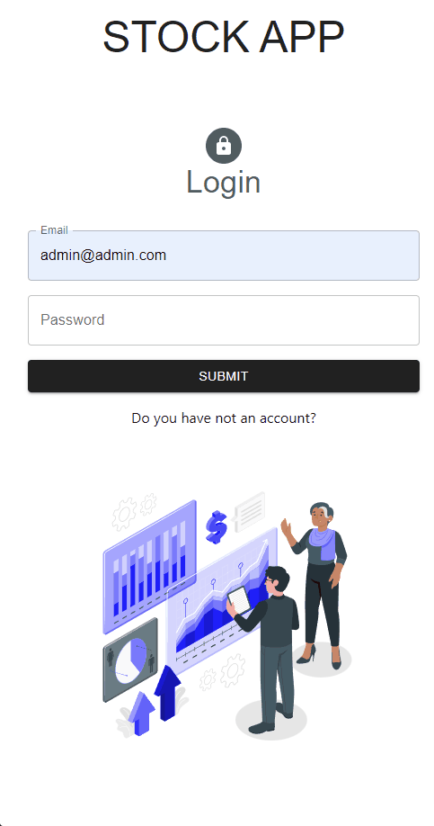

# Stock App
## Live Link: https://stock-app-fay.vercel.app/
## Description

Welcome to the Stock Application! This powerful platform provides users with the ability to manage their stocks efficiently. Whether you are a business owner, store manager, or simply want to keep track of your personal inventory, Stock App has got you covered.
## Features
- <span style="font-size: larger;">**User Authentication**</span>: Seamlessly create an account or log in to access the full functionality of the application.
- <span style="font-size: larger;">**Dashboard**</span>: Get an overview of your stock-related key performance indicators (KPIs) at a glance.
- <span style="font-size: larger;">**Firm and Brand Management**</span>: Easily add, edit, and delete firms and brands to organize your inventory effectively
- <span style="font-size: larger;">**Product Tracking**</span>: Keep track of your products, including purchases and sales, to maintain accurate stock levels..
- <span style="font-size: larger;">**Interactive Charts**</span>: Visualize your stock data with interactive charts for better insights and decision-making.
- <span style="font-size: larger;">**Responsive Design**</span>: Enjoy a smooth and intuitive user experience across various devices, including desktops, tablets, and mobile phones


## Project Skeleton
```
.
├── README.md
├── package-lock.json
├── package.json
├── postcss.config.js
├── public
│   ├── favicon.ico
│   ├── index.html
│   ├── logo192.png
│   ├── logo512.png
│   ├── manifest.json
│   └── robots.txt
├── src
│   ├── App.js
│   ├── app
│   │   └── store.jsx
│   ├── assets
│   │   ├── loading.gif
│   │   ├── stockApp.gif
│   │   ├── stockApp1.gif
│   │   └── result.svg
│   ├── components
│   │   ├── BrandCard.jsx
│   │   ├── Charts.jsx
│   │   ├── FirmCard.jsx
│   │   ├── KpiCards.jsx
│   │   ├── LoginForm.jsx
│   │   ├── MenuListItems.jsx
│   │   ├── RegisterForm.jsx
│   │   └── modals
│   │       ├── BrandModal.jsx
│   │       ├── FirmModal.jsx
│   │       ├── ProductModal.jsx
│   │       ├── PurchaseModal.jsx
│   │       └── SaleModal.jsx
│   ├── features
│   │   ├── authSlice.jsx
│   │   └── stockSlice.jsx
│   ├── helper
│   │   └── ToastNotify.js
│   ├── hooks
│   │   ├── useAuthCall.jsx
│   │   ├── useAxios.jsx
│   │   └── useStockCall.jsx
│   ├── index.css
│   ├── index.js
│   ├── pages
│   │   ├── Brands.jsx
│   │   ├── Dashboard.jsx
│   │   ├── Firms.jsx
│   │   ├── Home.jsx
│   │   ├── Login.jsx
│   │   ├── Products.jsx
│   │   ├── Purchases.jsx
│   │   ├── Register.jsx
│   │   └── Sales.jsx
│   ├── router
│   │   ├── AppRouter.jsx
│   │   └── PrivateRouter.jsx
│   └── styles
│       └── globalStyle.jsx
└── tailwind.config.js
```
## Expected Outcomes
<div >


</div>

## Technologies and Libraries
- <span style="font-size: larger;">**React.js**</span>: A powerful JavaScript library for building interactive user interfaces.
- <span style="font-size: larger;">**Redux**</span>: A predictable state management library for managing complex application states.
- <span style="font-size: larger;">**Axios**</span>: A popular HTTP client for making API requests and handling responses.
- <span style="font-size: larger;">**Tailwind CSS**</span>: A highly customizable CSS framework for creating stunning designs with minimal effort.
- <span style="font-size: larger;">**React Router**</span>: A popular routing library for React applications, allowing for dynamic and intuitive navigation between different pages within the application.
- <span style="font-size: larger;">**Formik and Yup**</span>: Powerful JavaScript libraries used for form management and validation. Yup is used to define validation schemas for form data, specifying the expected shape and constraints. On the other hand, Formik simplifies form state management, submission handling, and validation. Together, they ensure robust form validation and streamlined form handling for user input data.
- <span style="font-size: larger;">**Custom Hooks**</span>: Custom hooks have been implemented to encapsulate reusable logic and improve code organization and reusability. These custom hooks include:

    - **useAuthCall**: A custom hook that handles authentication-related API calls and state management.
    - **useAxios**: A custom hook that simplifies making HTTP requests using Axios and manages the loading and error states.
    - **useStockCall**: A custom hook that encapsulates the logic for making stock-related API calls and managing the stock-related states.

## Getting Started

To run the application on your local machine, follow these steps:

1. Clone the project to your computer:

   ```
   git clone https://github.com/iamfatihay/Stock-app.git
2. Open your terminal and navigate to the project directory.
   ```
   cd STOCK-APP
3. Install the dependencies:
    ```
    npm install
4. Start both frontend and backend:
    ```
    npm run dev
   ```
   Or start them separately:
   ```
   npm run backend  # Starts JSON Server on port 8000
   npm start        # Starts React app on port 3000
5. Open your web browser and visit  **http://localhost:3000**  to explore the Stock Application.

## 🚀 Quick Start & Demo Login

### **Demo Credentials (Ready to Use!)**

**Admin Account:**
- **Email:** `admin@stockapp.com`
- **Password:** `admin123`

**Demo Account:**
- **Email:** `demo@stockapp.com`  
- **Password:** `demo123`

**Or create a new account using the Register page.**

### **How to Test the App:**

1. **Clone and Install:**
   ```bash
   git clone https://github.com/iamfatihay/Stock-app.git
   cd Stock-app
   npm install
   ```

2. **Start the Application:**
   ```bash
   npm run dev
   ```
   This starts both frontend (port 3000) and backend (port 8000)

3. **Login and Explore:**
   - Visit: http://localhost:3000
   - Use the demo credentials above
   - Explore all features: Dashboard, Products, Brands, Firms, Purchases, Sales

## Demo Credentials

## Contribution
Welcome contributions to enhance the Stock Application! If you find any bugs or have ideas for improvements, please open an issue or submit a pull request. I appreciate your valuable input!

## License

The Stock Application is licensed under the [MIT License](LICENSE). Feel free to use, modify, and distribute the code as per the terms of the license.
